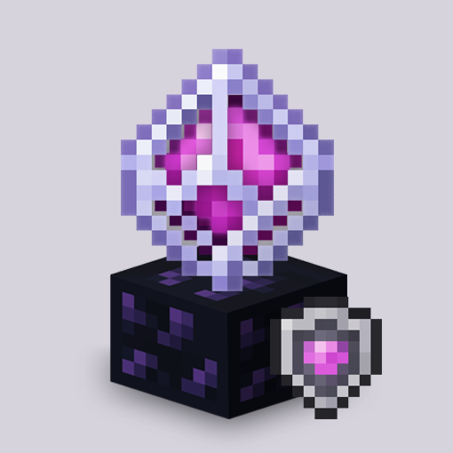

# Safe Crystals (NoCrystalBreak) - v1.1.3

**Version:** 1.1.3  
**Minecraft:** 1.21.10+  
**Requires:** Fabric Loader  

---

## Description

**Safe Crystals** (also known as **NoCrystalBreak**) is a Fabric mod that prevents accidental block breaking when placing End Crystals.  
This ensures faster, safer crystal placement without triggering the client-side block breaking animation.

---

## Features

- Prevents accidental obsidian breaking while holding an End Crystal  
- Stops client-side block breaking animations from triggering  
- Enables faster crystal placement and higher DPS  
- Fully client-side; does not affect server behavior  

---

## Requirements

- [Fabric Loader](https://fabricmc.net/)  
- [Fabric API](https://www.curseforge.com/minecraft/mc-mods/fabric-api)  

---

## Installation

1. Install **Fabric Loader** for your Minecraft version  
2. Add **Fabric API** to your `mods` folder  
3. Place `SafeCrystals-<version>.jar` in the `mods` folder  
4. Launch Minecraft with the Fabric profile  

---

## Configuration

- Config file is automatically generated in `config/nocrystalbreak.json`  
- Enable/disable the mod or adjust settings via the config file  

---

## Mod Menu Support

- If you have [Mod Menu](https://www.curseforge.com/minecraft/mc-mods/modmenu) installed, you can access mod settings in-game  

---

## Links

- [GitHub](https://github.com/mrkoszos/nocrystalbreak)  
- [Modrinth](https://modrinth.com/mod/safecrystal)  

---

## License

This project is licensed under the **MIT License**.
